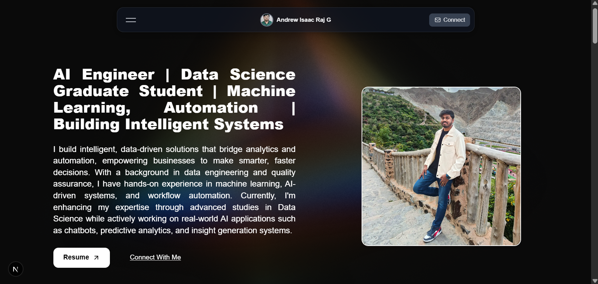

Developed a personal portfolio website using Next.js and Tailwind CSS, featuring a responsive, modern, and performance-optimized design. The site showcases my professional experience, education, and projects with dynamic components, clean animations. Integrated smooth navigation, interactive timelines, and reusable UI elements to ensure scalability and maintainability.

## Key Highlights:

Built with Next.js (App Router) for fast server-side rendering and optimized routing.

Styled with Tailwind CSS for flexible, utility-first design customization.

Deployed seamlessly on Vercel, ensuring global performance and CI/CD integration.

Fully responsive layout with modern UI/UX and accessibility considerations.

Modular component structure allowing easy updates and scalability.

## Deployed on Vercel

The web application was deployed on Vercel.
Website link: https://portfolio-andrewraj0510.vercel.app/

## Screenshot

